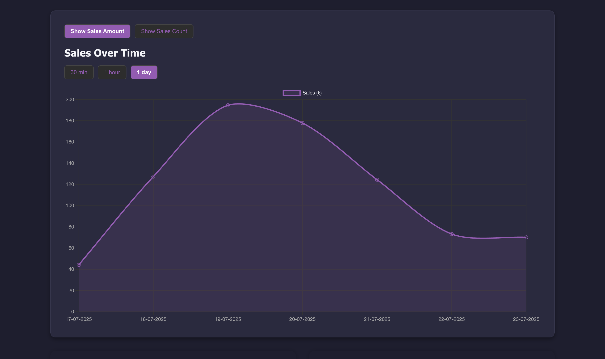

# SumUp Dashboard With SumUp Integration

A full-stack web application that provides a simple dashboard to visualize and analyze sales data from your SumUp account. It uses the SumUp OAuth 2.0 flow for secure authentication and fetches transaction data to present insightful metrics.



## Features

- **Secure Authentication:** Integrates with SumUp's OAuth 2.0 for secure, hassle-free login.
- **Sales Overview:** At-a-glance metrics for Total Sales, Total Transactions, and Average Transaction Value.
- **Date Filtering:** Filtering of the transactions based on the time period of interest.
- **Sales Trends:** A chart visualizing sales volume over a selected date range.
- **Product Insights:**
  - View a list of all products sold, aggregated by quantity.
  - Identify the top 10 most popular products.
  - Identify the 10 least sold products.
- **Combo Analysis:**
  - Discover which product combinations are most frequently purchased together.
  - See the least popular product combinations.
- **Detailed History:** Browse a complete list of individual transactions.

## Tech Stack

- **Backend:**
  - Java 17
  - Spring Boot 3
  - Maven
- **Frontend:**
  - React.js
  - `react-router-dom` for routing
- **API:**
  - SumUp REST API

## Getting Started

Follow these instructions to get the project running on your local machine.

### Prerequisites

- Java Development Kit (JDK) 17 or newer
- Apache Maven
- Node.js and npm
- A SumUp Developer Account

### 1. Configure SumUp API Credentials

First, you need to create an application in the SumUp Developer portal to get your API keys.

1.  Log in to the SumUp Developer Dashboard.
2.  Navigate to **"Client Credentials"** and create a new credential.
3.  Give your application a name (e.g., "Local Dashboard").
4.  In the **"Redirect URIs"** field, add the following URL:
    ```
    http://localhost:8080/api/sumup/callback
    ```
5.  Save the credential and take note of your **Client ID** and **Client Secret**.

### 2. Configure the Backend

Now, add your SumUp credentials to the project.

1.  Open the file `src/main/resources/application.properties`.
2.  Update the `sumup.client.id` and `sumup.client.secret` properties with the values you obtained from the SumUp dashboard. The `sumup.redirect.uri` should already be correctly configured.

    ```properties
    # /src/main/resources/application.properties

    sumup.client.id=YOUR_CLIENT_ID_HERE
    sumup.client.secret=YOUR_CLIENT_SECRET_HERE
    sumup.redirect.uri=http://localhost:8080/api/sumup/callback
    ```
3. If you want to test the application with mock data and no SumUp login, use `getAllTransactionsTest()` instead of `getAllTransactions()` used in `src/main/java/com/solod/sumup_dashboard_lightweight/controller/SummaryController.java`. 
### 3. Run the Application

You will need two separate terminal windows to run the backend and frontend servers simultaneously.

**Terminal 1: Start the Project**

```bash
# In the project's root directory
mvn spring-boot:run
```

The backend server will start on `http://localhost:8080`.
The frontend server will be run automatically on `http://localhost:3000`

### 4. Access the Dashboard

Open your web browser and navigate to:

**http://localhost:8080**

You will see the login page. Click the "Login using SumUp" button to start the authentication process and access your dashboard!

For mock data testing: **http://localhost:8080/sumup/dashboard?token=123** will bring you to the dashboard with mock data. 

**IMPORTANT:** Follow steps stated in **Configure the Backend** for the dashboard to work as expected with mock data.
